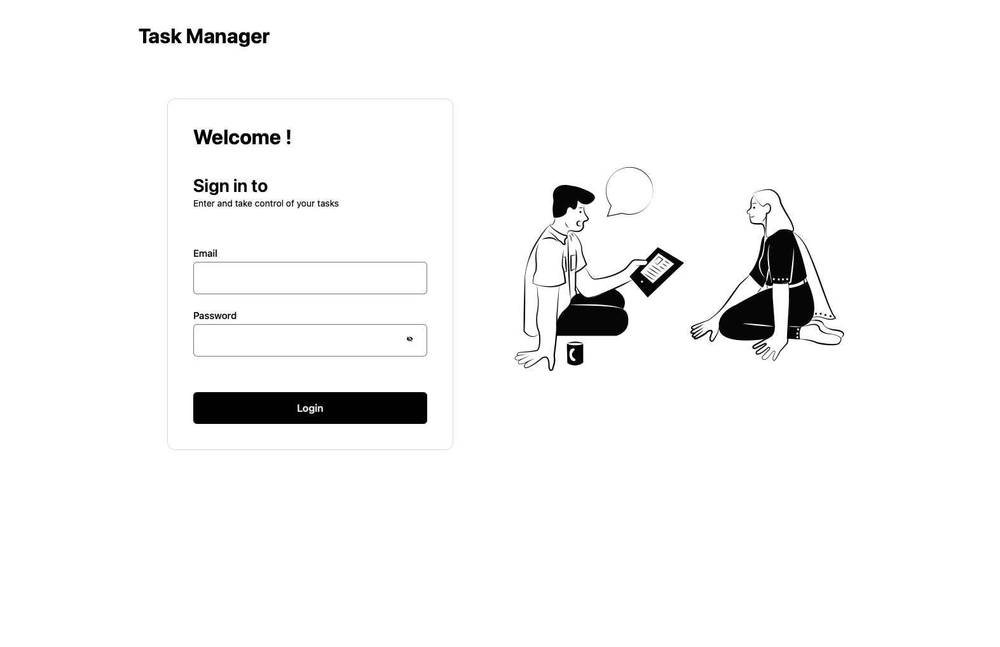
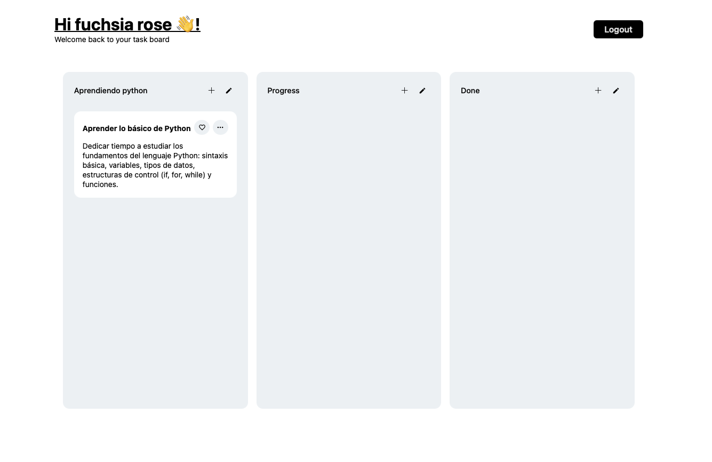

# Aplicación de Gestión de Tareas

Su objetivo es permitir la autenticación de usuarios y la gestión de tareas mediante un sistema de tablero estilo Trello, con funcionalidad de arrastrar y soltar, persistencia de datos.




## 🚀 Características

- **Autenticación Segura**

- [x] Permitir el inicio de sesión utilizando la API de ReqRes.
- [x] Persistencia de sesión incluso después de cerrar la página.
- [x] Redirección automática a la pantalla de tareas tras autenticación.
- [x] Implementar un método de verificación en la autenticación que utilice una
      clave dinámica generada por el frontend y que deba validarse en el backend
      (simulado).
- [x] El token de autenticación debe ser encriptado antes de ser almacenado en
      localStorage.
- [x] La autenticación debe incluir un retardo aleatorio de respuesta para simular
      latencia y detectar código que dependa de tiempos fijos.

- **Gestión de Tareas**

- [x] Implementar un tablero de tareas con drag and drop (arrastrar y soltar) para
      gestionar tareas.
- [x] Múltiples columnas con estados configurables (Ejemplo: "Pendiente", "En
      progreso", "Completado").
- [x] Agregar, editar y eliminar tareas.
- [x] Evitar la duplicación de nombres de tareas.
- [x] Confirmación de eliminación antes de borrar una tarea.
- [x] Persistencia de tareas por usuario, incluso después de cerrar sesión.
- [x] Cada tarea debe contar con un identificador único generado manualmente en
      base a una combinación de fecha, usuario y un hash encriptado.
- [x] Las tareas deben almacenarse en un formato de datos no convencional
      (ejemplo: árbol de nodos en lugar de un simple array).

- **Manejo de datos avanzado**

- [x] Implementación de un sistema de favoritos para marcar tareas como destacadas.
- [x] Persistencia de tareas y favoritos específicos por usuario.
- [x] Implementar una caché personalizada en memoria para evitar accesos
      repetidos al estado global.
      [x] Los datos de las tareas deben ser serializados y comprimidos antes de ser
      almacenados en localStorage o enviarse al backend.

## 🛠️ Tecnologías

- **Framework Frontend**: Next.js
- **Lenguaje**: TypeScript
- **Gestión de Estado**: Redux Toolkit
- **Estilos**: Styled Components
- **Manejo de Formularios**: React Hook Form + Yup
- **Arrastrar y Soltar**: DnD Kit
- **Encriptación**: CryptoJS
- **Compresión**: LZ-String

## 📋 Prerrequisitos

- Node.js (v18 o superior)
- npm o yarn
- Git

## 🚀 Comenzando

1. **Clonar el repositorio**

   ```bash
   git clone https://github.com/yourusername/.git
   cd task-manager
   ```

2. **Instalar dependencias**

   ```bash
   npm install
   # o
   yarn install
   ```

3. **Ejecutar el servidor de desarrollo**

   ```bash
   npm run dev
   # o
   yarn dev
   ```

4. **Abrir el navegador**
   Visitar [http://localhost:3000](http://localhost:3000)

El proyecto mantiene un mínimo de 50% de cobertura de código.

## 📦 Construir para Producción

```bash
npm run build
# o
yarn build
```

## 🏗️ Estructura del Proyecto

```
public/                   # Recursos estáticos
src/
├── app/                  # Router de Next.js
├── features/             # Caracteristicas especificas de la app
│   └── .../              # Nombre de la caracteristica
│       └── components/   # Componentes de la caracteristica
│       └── store/        # Redux store
├── shared/               # Código reutilizable y compartido
├── services/             # Integraciones de API y servicios
├── ui/                   # Estilos globales y temas
│   └── components/       # Componentes reutilizables
│   └── icons/            # Iconos pasados a componentes
└── utils/                # Funciones y utilidades
```

## 🔒 Características de Seguridad

- Almacenamiento local encriptado
- Validación y sanitización de entradas
- Rutas API protegidas

## 📊 Estructura de Datos

La aplicación utiliza una estructura de datos basada en árbol para la gestión de tareas, proporcionando:

- Organización eficiente de tareas
- Acceso rápido a tareas anidadas
- Actualizaciones de estado optimizadas

## 📝 Licencia

Este proyecto está licenciado bajo la Licencia MIT - ver el archivo [LICENSE](LICENSE) para más detalles.

## 🔗 Recursos

- [Next.js](https://nextjs.org/)
- [Redux Toolkit](https://redux-toolkit.js.org/)
- [Styled Components](https://styled-components.com/)
- [ReqRes API](https://reqres.in/)
